## Liquidity Rebalances: `sweep()`, `slide()`, and `bump()`

Baseline protocol incorporates three advanced liquidity rebalancing strategies—`sweep()`, `slide()`, and `bump()`—designed to optimize liquidity management based on NOMA token market dynamics.

- `sweep`: Triggered upon a 2% decrease in NOMA token price.
- `slide`: Triggered upon a 2% decrease in NOMA token price.
- `bump`: Triggered upon sufficient accumulation of liquidity surplus.

### `sweep()`

**Functionality:**
- **Liquidity Redistribution:** Moves liquidity from lower anchor ranges to the floor, enhancing its capacity to sustain higher market prices.
- **Surplus Deployment:** Redistributes excess liquidity across anchor ranges, bolstering liquidity depth near actively traded price levels.
- **Expansion of Discovery Range:** Increases liquidity capacity in the discovery range, enhancing overall market liquidity.

🟩 Floor 
🟨 Anchor 
⬜ Discovery

```mermaid
    xychart-beta
    title "Distribution"
    x-axis "Price" [0.8, 0.84, 0.88, 0.92, 0.96, 1, 1.04, 1.08, 1.12, 1.16, 1.2, 1.24, 1.28, 1.32, 1.36, 1.4, 1.44, 1.48]
    y-axis "Liquidity Depth" 0.025 --> 0.98
    bar [0]
    bar [1]
    bar [0]
    bar [0,0,0,0,0.25,0.25,0.25,0.25,0.25,0.25,0.25,0.25,0.25]
    bar [0]
    bar [0,0,0,0,0,0,0,0,0,0,0,0,0.35,0.35,0.35,0.35,0.35,0.35]
    bar [0]
    bar [0]
    bar [0]
    bar [0]
```  

> During bullish phases, `sweep()` leverages surplus liquidity to enhance readiness for potential price spikes, optimizing liquidity provision.
{: .prompt-tip }

### `slide()`

**Functionality:**
- **Liquidity Adjustment:** Repositions anchor liquidity closer to the current NOMA price, maximizing absorbable liquidity capacity.
- **Depth Reduction in Discovery Range:** Lowers liquidity thresholds in the discovery range, facilitating quicker market responses to price declines.
 
<!-- ⬜ -->
🟩 wETH
🟪 NOMA 

```mermaid
    xychart-beta
    title "Distribution"
    x-axis "Price" [0.8, 0.84, 0.88, 0.92, 0.96, 1, 1.04, 1.08, 1.12, 1.16, 1.2, 1.24, 1.28, 1.32, 1.36, 1.4, 1.44, 1.48]
    y-axis "Liquidity Depth" 0.025 --> 0.98
    bar [0]
    bar [1,0,0,0.25,0.25,0.25,0.25,0.25,0.25,0.25,0.25,0.25]
    bar [0]
    bar [0]
    bar [0]
    bar [0]
    bar [0]
    bar [0,0,0,0.225,0.2,0.175,0.15,0.125,0.15,0.175,0.2,0.225,0.35,0.35,0.35,0.35,0.35,0.35]
    bar [0]
    bar [0]
    line [0,0,0,0.225,0.2,0.175,0.15,0.125,0.15,0.175,0.2,0.225]
```  

> `slide()` adjusts liquidity dynamics during bearish trends, aiming to maintain optimal liquidity provision while mitigating potential price volatilities.
{: .prompt-warning }

### `bump()`

**Functionality:**
- **Price Impact Strategy:** Attempts to elevate the NOMA Base Liquidity Value (BLV) by assessing the feasibility of buying back circulating tokens at higher prices.

🟩 Floor 
🟨 Anchor 
⬜ Discovery

> `bump()` strategically boosts NOMA token prices, potentially enhancing borrowing capacity for token holders and optimizing market positioning.
{: .prompt-info }