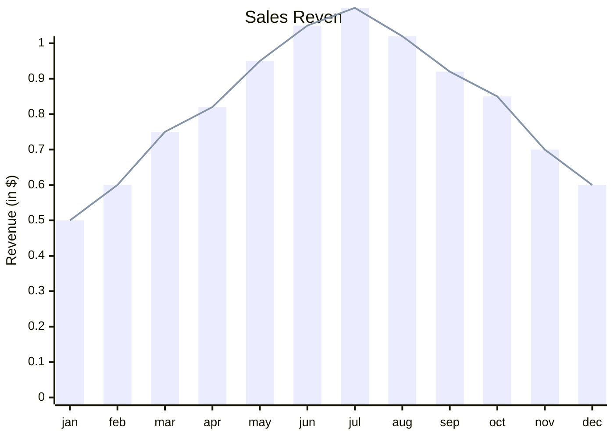

The automated tokenomics and permission-less market-making narrative was introduced by the Baseline protocol and YES token in March 2024. The project launched on the Blast layer two (L2) blockchain with the aim to provide other projects with a technology they can tap into to launch tokens with more predictable dynamics, while also benefiting from the native integration with a powerful lending/credit facility. Baseline leverages Uniswap V3 concentrated liquidity as the decentralized exchange (DEX) for its market-making strategy.

