Noma's market-making strategy centers on Uniswap V3's concentrated liquidity pools, optimizing liquidity provision through three strategically positioned LP positions. This allows Noma to capture trading fees and participate in market movements effectively, while actively managing concentrated liquidity to adapt to changing market conditions.

## Concentrated Liquidity

The structure of the liquidity is composed as follows:

🟩 Floor 
🟨 Anchor 
⬜ Discovery

```mermaid
    xychart-beta
    title "Distribution"
    x-axis "Price" [0.8, 0.84, 0.88, 0.92, 0.96, 1, 1.04, 1.08, 1.12, 1.16, 1.2, 1.24, 1.28, 1.32, 1.36, 1.4, 1.44, 1.48]
    y-axis "Liquidity Depth" 0.025 --> 0.98
    bar [0]
    bar [1]
    bar [0]
    bar [0,0,0,0,0.25,0.25,0.25,0.25,0.25,0.25,0.25,0.25,0.25]
    bar [0]
    bar [0,0,0,0,0,0,0,0,0,0,0,0,0.35,0.35,0.35,0.35,0.35,0.35]
    bar [0]
    bar [0]
    bar [0]
    bar [0]
```  

### Floor
This position contains the majority of the reserves backing the token  concentrated in a very narrow range - the minimum width of a "tick" of liquidity on Uniswap V3. The floor position is responsible for absorbing the circulating supply during periods of high market activity and maintaining the token's intrinsic minimum value.

### Anchor
As the price leaves the IMV zone, the anchor liquidity meets demand by supplying liquidity in the price range between the token's IMV itself and the current price decided by the market. This range is wider than the floor position by design.

### Discovery
As the price keeps increasing leaving behind the anchor zone, it is served by the discovery position, which is responsible for distributing the supply into the market on a wider range. As the name suggests, this position enables the "price discovery" process of the asset.